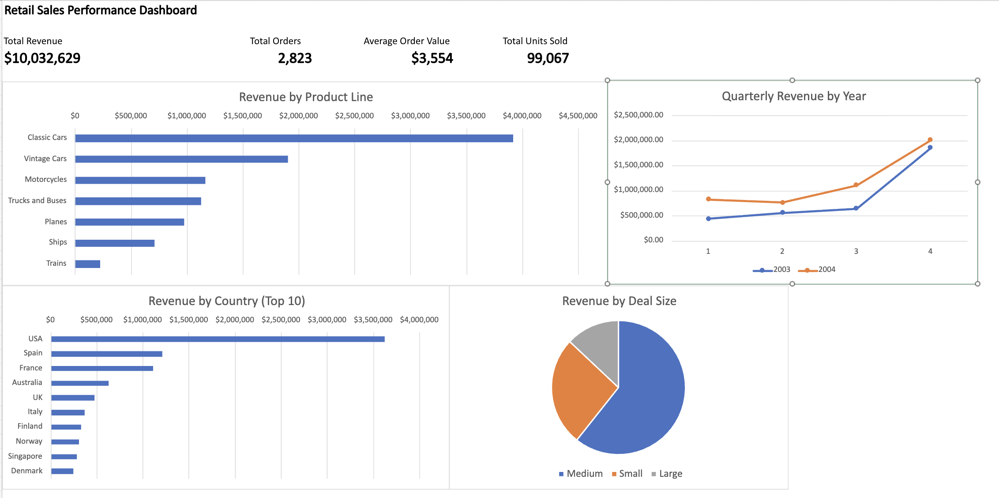

# Retail Sales Performance Tracker

Analyzed 2,800+ retail transactions across 19 countries using Excel to track revenue performance.

## Key Findings
- Classic Cars drives 39% of total revenue ($3.9M)
- Q4 is the strongest quarter across every product line
- Revenue grew 34% from 2003 to 2004
- USA accounts for 36% of sales
- Medium-sized deals generate 61% of all revenue

## Skills Demonstrated
SUMIFS, Pivot Tables, Pivot Charts, Conditional Formatting, 
Dashboard Design, Data Cleaning

## Data Source
[Kaggle - Sample Sales Data](https://www.kaggle.com/datasets/kyanyoga/sample-sales-data)
